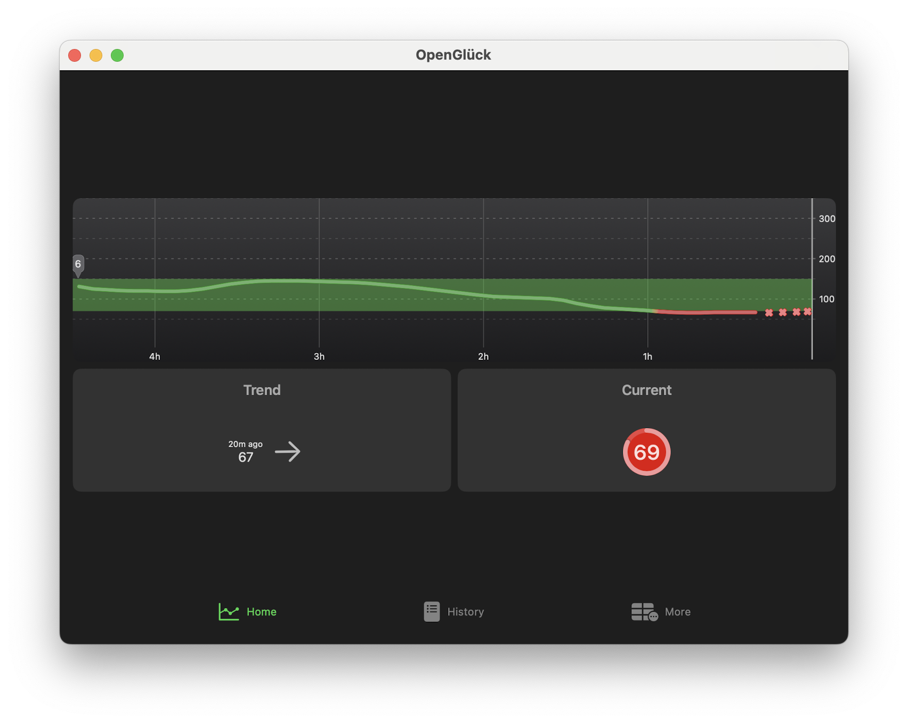
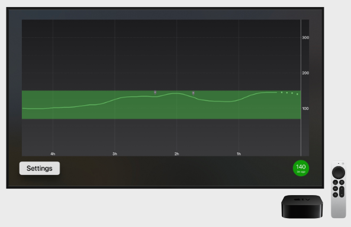
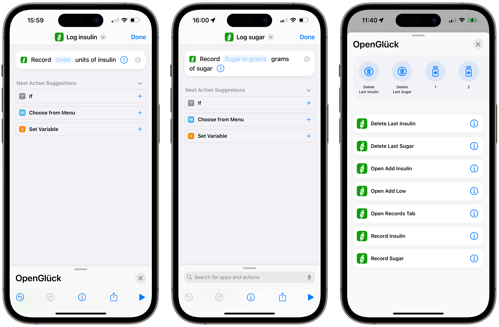

# OpenGlück Swift App (iOS, macOS, watchOS, iPadOS, tvOS)

This is the OpenGlück App for Apple platforms (iPhone, Apple Watch, Mac and
Apple TV).

See [opengluck.com](https://www.opengluck.com/) for an overview of OpenGlück,
and how the OpenGlück App (pictured in bottom-right corner below) integrates
with compatible apps:

## Complications

All complications sizes for watchOS 10 are supported.

And, if you have a Series 9 or Ultra 2, you can use the *double tap* gesture. I
have mine configured so that a *single double tap* shows the graph, and a
*second double tap* opens the app. Very handy!

(Remember that we're subject to the same limitation than all Apple Watch
widgets. See the FAQ item below for a more detailed explanation.)

# iPhone / iPad

The [OpenGlück app](https://github.com/open-gluck/opengluck-ios) supports all
widgets sizes of iOS 17, including Standby — if you are lucky and have an
iPhone with Always-On, this makes a great nighttime BG reader.

# macOS

The [native Mac app](https://github.com/open-gluck/opengluck-ios) means you
don't have to reach out for your phone to know your blood glucose.

# tvOS

Well, tvOS started more as a joke than anything else. Please let me know if you
have serious uses for it, though, I'd be more than happy to read about it.

# Prerequisites

- a running [OpenGlück server](https://github.com/open-gluck/opengluck-server)
  with a token,
- a compatible app sending data to the server (see the
  [opengluck.com](https://www.opengluck.com/) for a list of compatible apps).
 If you don't have an app sending data to OpenGlück Server, the OpenGlück App
 will have nothing to show you!

# Installation

If you don't have a developer account, you might install this app by joining a
team on TestFlight. Reach out to a developper with the app available on
TestFlight, and ask them to invite you.

If you have a developer account, you can compile the source code yourself and
install on your devices. See [docs/DEVELOPER.md](docs/DEVELOPER.md) for more
info.

# Configuration

You will first need to get your token; to do so, browse your OpenGlück server
and click *API Access*. Note the host and token, then run the app and paste the
required configuration values.

# iOS, iPadOS, macOS

Then, open the app, click *More*, and paste the information.

# watchOS

The watchOS version takes its configuration from the iOS app. First, configure,
iOS as described above, then run the watchOS app. Note that the connection
between the watch and the iPhone uses an Apple framework that is known for
hiccus, in case of trouble, you might need to restart the iOS app while the
watchOS app is running, or maybe restart both your watch and iPhone and start
by running the watchOS app. Please note that only the initial setup is painful,
once you're good, you're good.

# Siri

You can use Siri to record insulin units, or sugar, using phrases as such:

- *Hey Siri, OpenGlück 6 units*;
- *Hey Siri, OpenGlück 10 grams*;
- *Hey Siri, delete the last insulin in OpenGlück*;
- *Hey Siri, delete the last sugar in OpenGlück*.

If you're feeling in a hurry, Siri understands *OG* is a synonym for *OpenGlück* so you can also say *Siri, 2 units OG* to record two insulin units taken.

You can also omit the quantity (Siri will ask you for a value), or create your own custom phrases using a shortcut (see below). Creating your own custom phrase has the added benefit that you don't need to include the app name (or the *OG* synonym) in it, but needs to be done manually.

# Shortcuts

The OpenGlück app integrates with the Shortcuts app, allowing you to create more custom actions and trigger phrases (that don't include the app name).

For example, you can use this to create two custom phrases, *log insulin* and *log sugar*, which you could trigger by Siri saying *Siri, log insulin* or *Siri, log sugar*:

You can have a look a the suggested shortcuts by opening the Shortcuts app, go to the Shortcuts tab, and open the OpenGlück section.

# Deeplinks

You can use the following deep-links to open the OpenGlück app in a desired
state:

- [`opengluck://records`](opengluck://records): open the Records tab
- [`opengluck://add-low`](opengluck://add-low): interactively add sugar
- [`opengluck://add-insulin`](opengluck://add-insulin): interactively add insulin

# Developer Info

If you're a developer and interested in joining in the OpenGlück ecosystem,
please browse [docs/DEVELOPER.md](docs/DEVELOPER.md) for more tidbits.

# Limitations

If you chose to install the app using TestFlight, you will be subject to the
usual WidgetKit restrictions on the total amount of times widgets and
complications can refresh. This is something Apple actively enforces, however
OpenGlück is designed to help you out: widget will display an icon when data is
outdated (so that if you see something in a widget/on your watch, you know it's
current), and a single click/tap will launch the app where you will be able to
read live data.

Note you can also use the Contact Trick (see below). This works on all devices
and updates almost in real-time, with the downside that you can always be sure
that the data is fresh.

If you're a registered developer, and installed the app yourself with XCode (ie
not using TestFlight), you can lift WidgetKit restrictions like so.

*Important: WidgetKit Developer Mode is enabled only for apps you build and install on your devices. It has no impacts on apps downloaded from the App Store or Test Flight.*

#### Apple Watch

Open **Settings**, then navigate to **Developer**. In the secret menu, check **WidgetKit Developer Mode**. 

#### iPhone, iPad

Open **Settings**, then navigate to **Developer**. In the secret menu, check **WidgetKit Developer Mode**. 

# Contact Trick

There is a work around the restrictions detailed above, by asking the app to
update the photo of a contact. The trick works because you can add a contact on
a watch face, which will show its profile photo. Since this is an Apple widget,
it is not subject to the same restrictions, which means it updates almost
instanstly.

To enable the Contact Trick:

1. go to the More tab and enable the Contact Trick
2. grant permission to update the contacts
3. manually create a contact whose email address is bg@calendar-trick.opengluck.com

# FAQ

## Siri phrases don't work.

The system takes sometimes as long as ten hours to register the phrases in newly installed apps, so if you just installed the app and Siri fails to recognize the phrases, please wait a while.

On your first conversation with a phrase concerning OpenGlück, Siri should ask you confirmation to enable support for the app, after which point the phrases should work without further configuration. You can force this manually by opening the Shortcuts app, go the Shortcuts tab, open the OpenGlück section, then click on the *i* rounded button at the top-right corner of the screen and enable *Siri*.

### watchOS Caveats

This toggle doesn't seem to exist on the watchOS and it appears the setting on iPhone doesn't mirror on the watch, so your best luck is that Siri eventually pick your phrase and interactively ask you to enable support. You can also create your custom shortcut, they are always picked by Siri, and do not need to include *OpenGlück* in the phrase which might be more convenient.